# Quick Start Guide

This guide helps introduce new users to the Community Broadband Financial Sustainability Model. It’s aim is to allow users to configure a simple network quickly, to gain an understanding of how the application works. The full documentation is appropriate for users looking to model or tune a specific scenario with a high degree of accuracy.

## Select a Country
The first significant choice to make is to pick a country. When a country is selected, a large number of model parameters are set within the model’s options and Expert Options. For a good introduction to the application, please choose a United Nations member state. In the case of non-member economies and dependancies, data used to derive household incomes and sizes, wages, population growth, and costs for electricity might be missing or invalid.

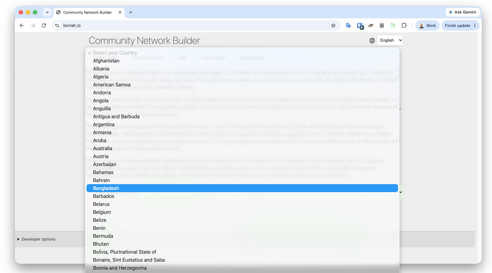
 

At the moment it’s not possible to configure a complex network scenario then change the country. If you want to change countries, it’s best to refresh the page to start fresh.

## Community Characteristics
In the first section of user input, set your community's household income. If you're starting the network build with a grant, add that amount to the CapEx subsidy.

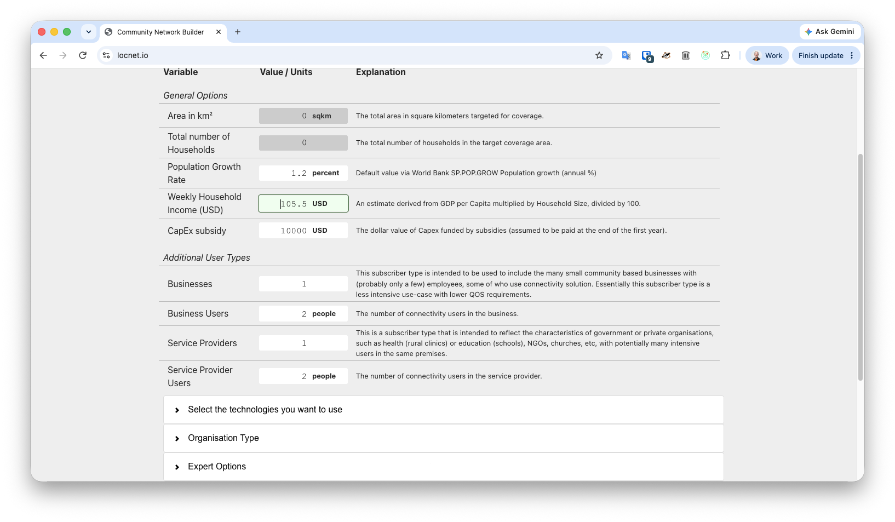

If your community has businesses or community service providers (like government offices, clinics, libraries, etc.) input how many, and on average how many people each employs.

## Select a Technology and Frequencies
Pick as many technologies as you think you’ll want to implement, but remember that sustainable community networks are often simple.

Fixed Wireless is generally the most cost effective technology for low population densities. Fibre to the Home is the most cost effective for high population densities, and economies with large households.  The most cost effective networks are built with ISM band spectrum - the 2.4 and 5.8 GHz bands selected by default for all users of the model.

Mobile services require other frequencies to be selected. Lower frequencies perform better in areas of high vegetation, but are more expensive to implement and operate. Higher frequencies are less expensive to implement and operate, but perform poorly in the presence of vegetation.

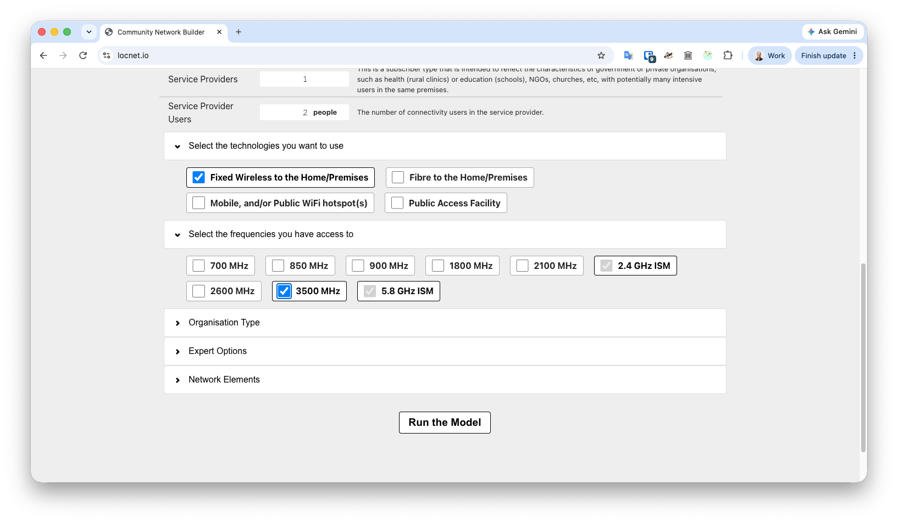
## Organisation Type
Although this is a Community Network modeller, in practice many local networks are run as commercial ventures. This option has a major impact on Expert Options that impact network design, availability, staff pay, taxes, and requirements for profit. 

## Expert Options
For a “Quick Start” introduction to this model, leave these options alone. Once you've built a network you might find labour costs outstrip revenue. You can adjust the amount of employees per hundred customers and what you pay them in the Expert Options.

## Network Elements
From here, the quick start guide is closely aligned with the full documentation. This is the most complex and impactful part of the application.

## Add Network Location
All networks must have at least one netework location configured for delivering service. For a quick start, just add one location. Multiple location networks are more complex to configure.

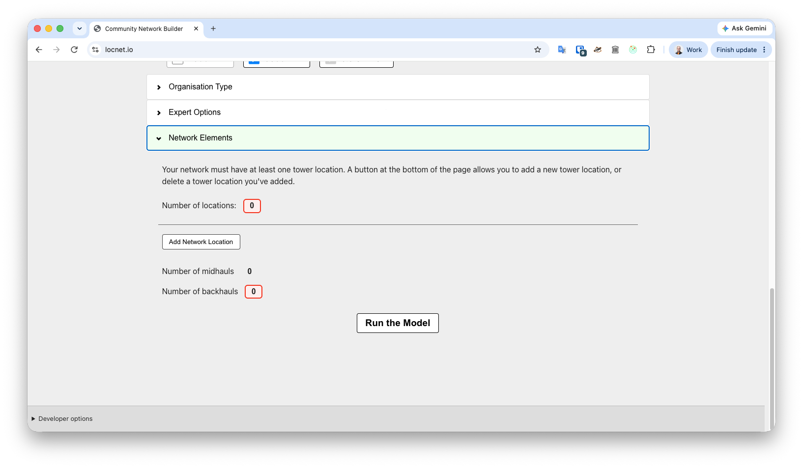

## Configure Network Location
The first thing you'll see when you add a new location is a map. Move the marker by dragging or double clicking where you want it. This will be your tower or POP location. Make sure you're as accurate as possible - this application takes terrain and vegetation into account.

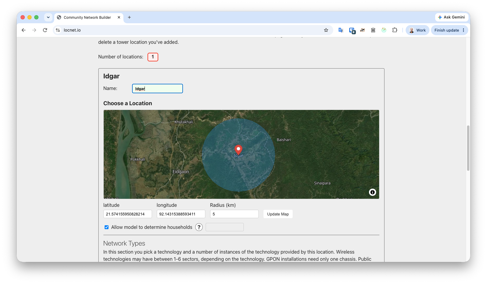

## Add Network Type
Once you've selected a location, you need to add a network type.
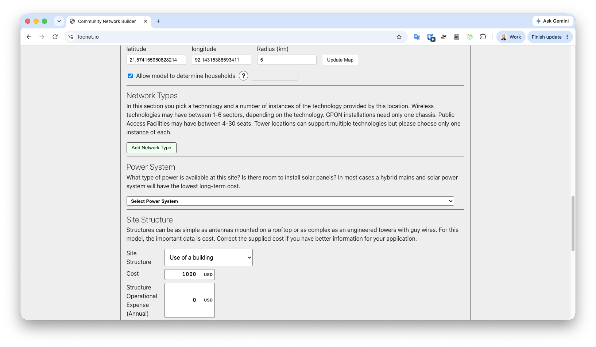
When you click this button, you’ll get a pull-down menu allowing you to select from the available network types. If you don’t see a network option you’re expecting to use, go back and ensure you’ve selected the technology and any required frequency. Then remove the network type and click the Add Network Type button again to regenerate the list.

For each wireless network type at a location, you need to choose how many sectors, or antennas you'll use. Each sector adds network capacity, but also Capital and Operational expenses. For GPON networks, you add a number of cards - each of which supports around 1,000 connections.

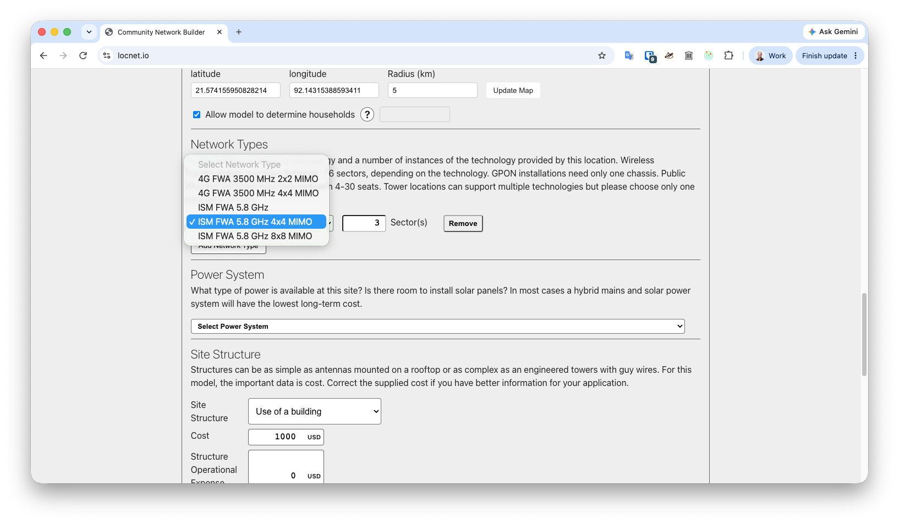

## Choose a Power System

What power systme you choose depends on a few factors. If you have space for solar panels, hybrid systems that combine mains and solar usually have the lowest cost over the life of the system.

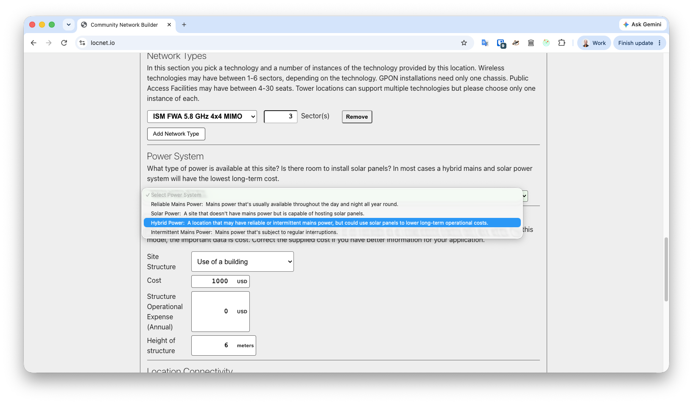

## Choose a Structure

 Capture any building or fit-out expenses in the cost box, and any lease costs in the annual operational expense box. Height is very important for wireless technologies. If you don't set this high enough, you won't get good coverage from your technologies.

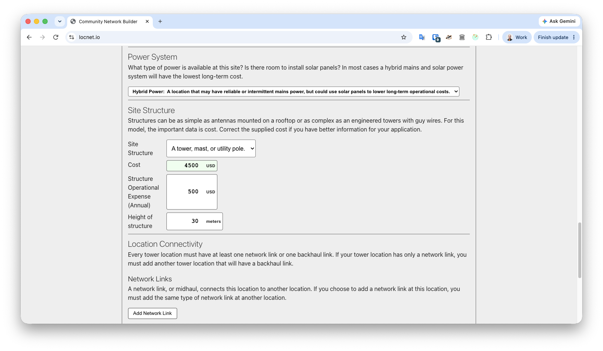

## Network Links
For a quick start, skip this step.

## Backhaul Links
Backhaul, power, and staff costs are the main operational expenses of any network. Ensuring that backhaul charges are accurately estimated is important if the model is to be relevant and useful. The unit of traffic cost is Megabits per Second. If your backhaul just has a fixed monthly charge for unlimited traffic, set USD Cost of traffic to 0.

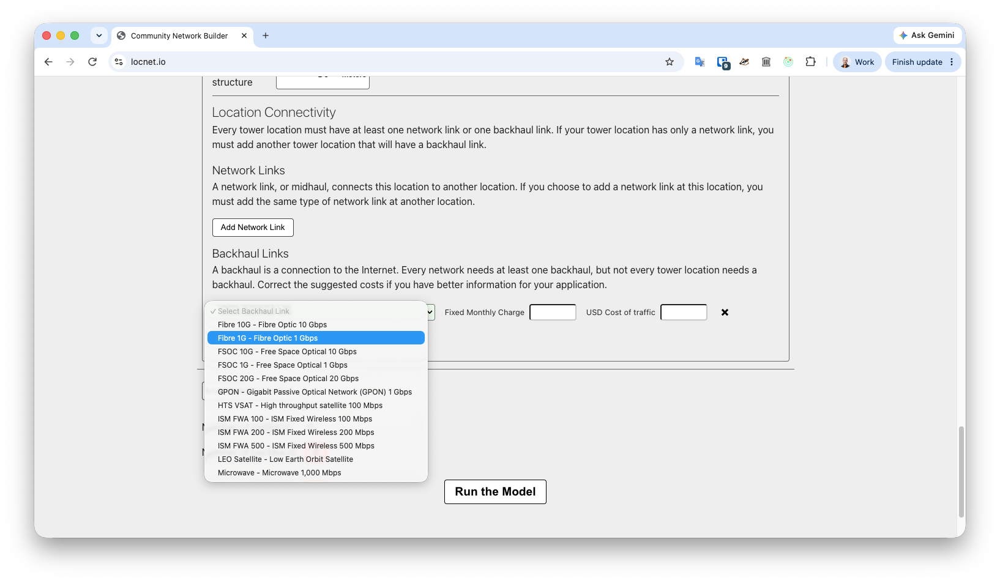
 

Backhaul must be added to at least one location in a network. A method should be chosen, a fixed monthly charge entered, and a cost per Mbps for traffic. The model assumes that cost of backhaul will increase over time with traffic demand, based on the USD cost of traffic per Mbps entered here.

## Run the Model
The  button underneath the network section is used to run the model.

Once it’s run a set of results will appear below, and all user input will collapse into a section above the Summary of Outcomes called “Model Parameters”.

## Summary of Outcomes
The information entered about your community and the technology choices made in building a solution all influence the Outcomes.

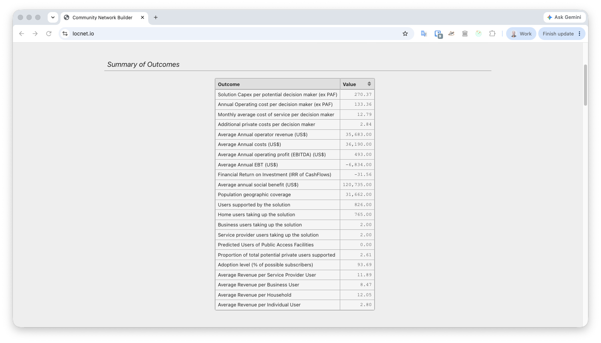

This summary is an overview of information contained in the Network Details and Elements sections, the Demand and Community Benefit Analysis, the Profit and Loss Statement, and the Investment and Cashflow Statement. All of these tables can be examined individually for more details. Explanations for every data element can be found in the full documentation.

## Profit and Loss

If you find your netork is losing money - a frequent occurance for first time users - look to the Profit and Loss statement. Sustainable networks need to have costs lower than client revenues.

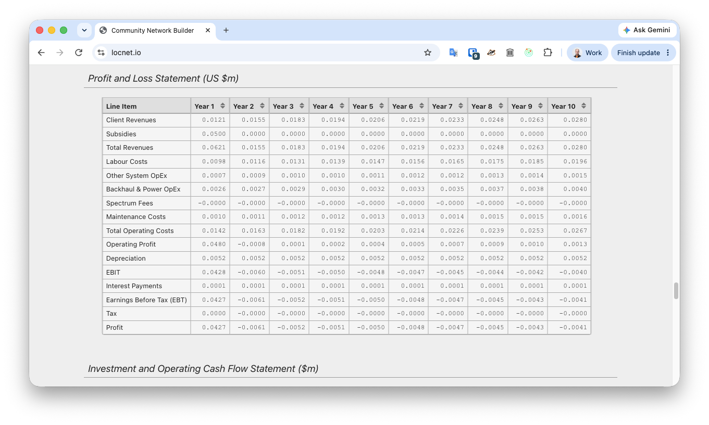